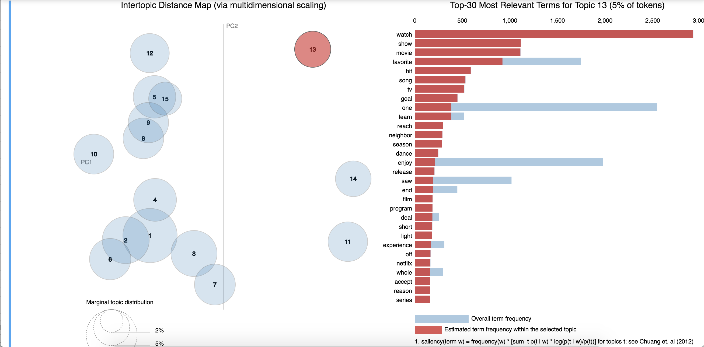
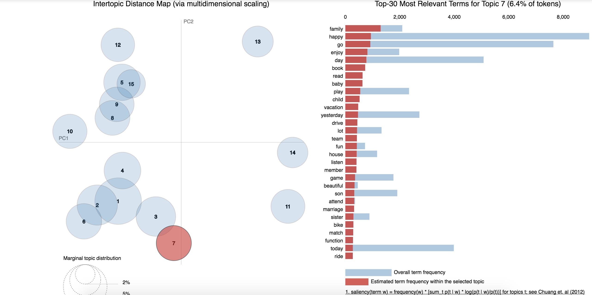
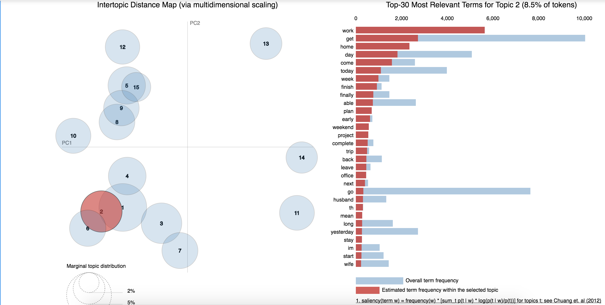
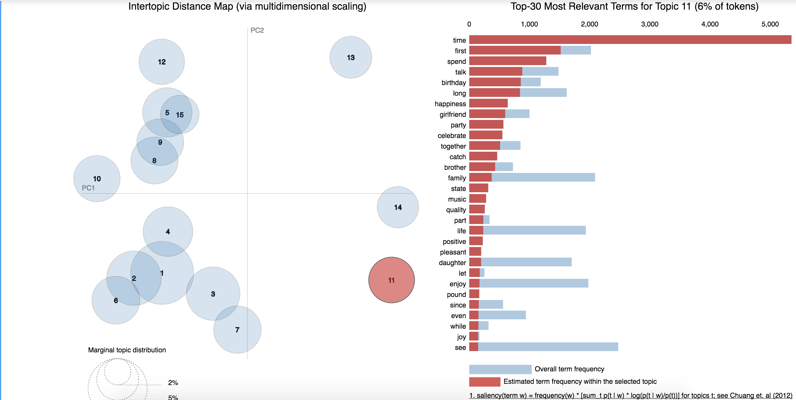
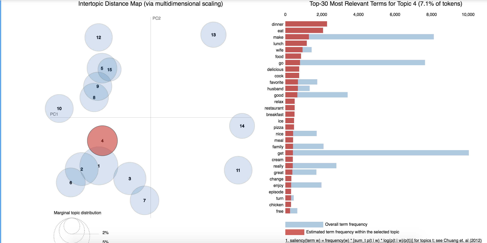
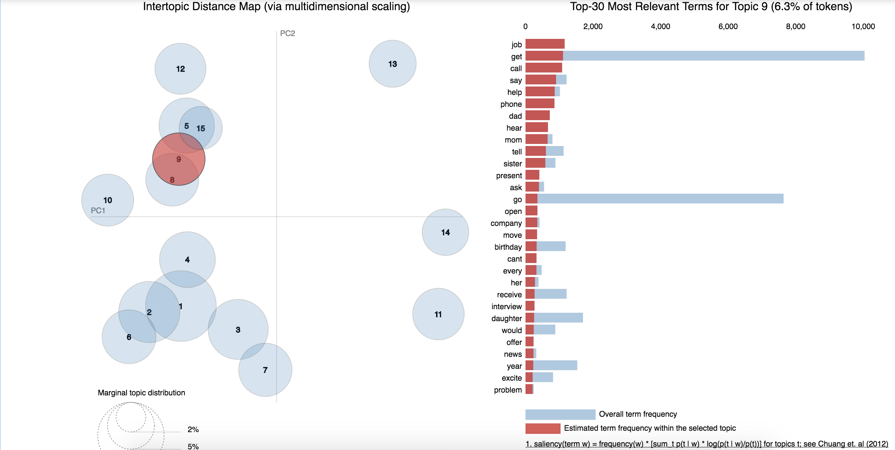

As time goes by, the factors of people’s happiness are constantly changing. What is the reason for human beings’ happiness in this age? Let’s find it out by analyzing HappyDB consisted of about 100 thousand happy moments of volunteers.

#Part One: Word analysis

In order to get a general idea of happiness reasons, I draw a picture of words frequency. In the following picture, we can find some words, like "friend", "work" and "time", have relationship with happiness to some degree. However, this analysis restricts to words and looking at units beyond just words might give us more ideas about people's happiness.

```{r echo=FALSE, message=FALSE, warning=FALSE}
library(dplyr)
clean_word=read.csv('../output/clean_word.csv')
library(wordcloud)
clean_word%>%
  count(lem_word)%>%
  with(wordcloud(lem_word,n,max.words = 100,colors=brewer.pal(9,"Blues")))
```

#Part Two: Topic modeling

For more information beyong words, I choose LDA(latent Dirichlet Allocation Model) to analyse data. Before applying the model, I lemmatize words first, which reverts words into roots. Train data with LDA  and then get the interactive result in following link: http://localhost:8888/notebooks/Documents/applied_data_science/Project1-RNotebook/lib/LDA-Copy3.ipynb

In the visualization of LDA model, the radius of a bubble represents the frequencuy of the topic and distances between bubbles stand for similarity of topics. For topic 13 in the screen shots, it mainly talks about watching TV showsor moives, which is  related to entertainment. In real life, it is also reasonable that relaxing activities could bring happiness to people.



Tpoic 7 is about enjoying time with family. What is interesting here is that "read" and "book" also appear in this topic, which indicates that there is an hidden relationship between spending time with family and reading books. 

Topic 2 is more related to finishing work and going back home.





In following topic, "time" and "first" are two top words, so this one might be high related with trying new things. 

Topic 4 is a typically food topic. It shows that a delicious dinner or lunch can also make people happy.It is showed in the picture that, "dinner" appears more frequently than "lunch" and "breakfast", which indicates that people pay more attention to dinner. Anohter information from this plot is people's favourite food, like ice-cream, pizza and chicken. 

The happy source in topic 9 might be getting a job based on words, like "job", "get" and "interview".








#Part Three: Analyse with additional information

In order to having a deeper understanding to human beings' happiness, I add other information included in the data file into analysis, such as topic dictionaries and volunteers' information.

Following picture is a wordcloud about 'family' topic. As we can see in the picture, people talk more about daughter and son than husband and wife. What's more, "mom", "dad", "brother" and "sister" appear with less frequency. It is an interesting phemomenon that people get more happiness from their children than their parents.

```{r echo=FALSE, message=FALSE, warning=FALSE}
temp2=read.csv('../output/clean_word_topic.csv')
library(dplyr)
library(wordcloud)
temp2[temp2$label=='family',]%>%
  count(lem_word)%>%
  with(wordcloud(lem_word,n,max.words = 100,colors=brewer.pal(9,"Oranges")))
```

In the wordcloud of entertainment, the most salient word is "watch" then is "show" and "movies". These words are as same as the result from LDA model in topic 13. Besides that, "play video games" and "read book" are also important in this wordcloud.

```{r echo=FALSE, message=FALSE, warning=FALSE}
temp2=read.csv('../output/clean_word_topic.csv')
library(dplyr)
library(wordcloud)
temp2[temp2$label=='entertainment',]%>%
  count(lem_word)%>%
  with(wordcloud(lem_word,n,max.words = 100,colors=brewer.pal(9,"Reds")))
```

From following picture about exercise, we could summarize that running and walking play a significant role in bringing happiness to people.

```{r echo=FALSE, message=FALSE, warning=FALSE}
library(dplyr)
library(wordcloud)
temp2[temp2$label=='exercise',]%>%
  count(lem_word)%>%
  with(wordcloud(lem_word,n,max.words = 100,colors=brewer.pal(9,"Blues")))
```

As for the topic about pets, unsurprisingly, "cat" and "dog" appear frequently.

```{r echo=FALSE, message=FALSE, warning=FALSE}
library(dplyr)
library(wordcloud)
temp2[temp2$label=='pets',]%>%
  count(lem_word)%>%
  with(wordcloud(lem_word,n,max.words = 100,colors=brewer.pal(9,"Oranges")))
```

About school, people might get happiness from passing exams or doing a good job in study.

```{r echo=FALSE, message=FALSE, warning=FALSE}
library(dplyr)
library(wordcloud)
temp2[temp2$label=='school',]%>%
  count(lem_word)%>%
  with(wordcloud(lem_word,n,max.words = 100,colors=brewer.pal(9,"Blues")))
```

After that, I draw a bar plot about different topic. From the plot, the three most popular topics are "family", "food" and "people", which means that it is easier to get happiness when doing things related with these thress topics.

```{r echo=FALSE, message=FALSE, warning=FALSE}
temp2$label=as.character(temp2$label)
library(ggplot2)
library(plyr)
library(dplyr)
a=aaply(temp2$label,1,nchar)
temp3=temp2[a<13,]
ggplot(data=temp3)+
  geom_histogram(mapping=aes(x=label,y=..count..),stat="count",fill="lightblue", colour="black")+
  theme(axis.text.x = element_text(size = 15, face = "bold",hjust=1,vjust = 1, angle = 45))

```


#Part Four: Conlusion

By analysing HappyDB, we now have more ideas about why people are happy. 

+ Watching movies/ TV shows as entertainment
+ Having fun and spending time with family
+ Finishing everyday work and going back to home
+ Doing things for the first time and learning new things
+ having delicious food in dinners or lunches
+ Passing an interview and getting a new job

